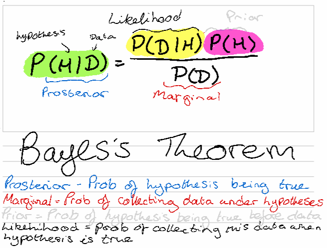
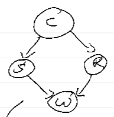

# Welcome to Math Bot. 
Math bot does some specific calculations in Python, so that you can do other things :)

Math bot will ask you what you wish to calculate, and can remember previously given arrays and data points to work with again.
Its memory is reset every time you finish working with Math bot.

Although capitalisation doesn't matter when requesting a specific calculation, spelling and any extra spaces will confuse math bot. Below are a list of calculations Math bot can do, and what you need to type to trigger that calculation.

To finish, type "end".
## What Math Bot can do:
### Accuracy
    - For this, type "accuracy". 
Math bot will ask for the nmber of correctly classified data points, and then the total number of data points, and return the accuracy.
### Precision
    - For this, type "precision". 
Math bot will ask for the number of true and false positives, and return the precision.
### Recall
    - For this, type "recall". 
Math bot will ask for the number of true and false negatives, and return the precision.
### MSE (Mean Squared Error)
    - For this, type "mse". 
Math bot will calculate the MSE after asking for a list of x's and corresponding y's
### MAE (Mean Absolute Error)
    - For this, type "mae". 
Math bot will calculate the MAE after asking for a list of x's and corresponding y's
### F1
    - For this, type "f1". 
Math bot will calculate the f1 given the umber of true positives, false negatives and false positives.
Math bot does not remember any previously given false/true positives/negatives.
### KNN Weights (K Nearest Neighbour Weights)
    - For this, type "knn weights".
Using x's and corresponding y's, Math Bot calculates the euclidean distance to calculate the K Nearest Neighbour weights.
### SD (Standard Deviation)
    - For this, type "sd".
Math bot will ask for a list of values and will calculate the SD.
### Mean
    - For this, type "mean".
Math bot will ask for a list of values and will calculate the mean.
### Euclidean Distance
    - For this, type "euclidean distance" or "euclidean.
Math bot will ask for a list of xs and ys and will calculate the euclidean distance.
### Manhattan Distance
    - For this, type "manhattan distance" or "manhattan.
Math bot will ask for a list of xs and ys and will calculate the manhattan distance.
### Gaussian Probability (Normal Distribution)
    - For this, type "gaussian probability" or "gaussian".
Math bot will find the probability density at a particular point given a list of numbers
### Gaussian Mixture Model
    - For this, type "gaussian mixure model" or "mixture".
Math bot estimates parameters of a Gaussian mixture model probability distribution when you give it some data.
It will plot all the data in blue, and then the means in pink on a scatter graph.
Currently only supports 2 arrays (xs and ys for example)
Please read this documentation for more information: https://scikit-learn.org/stable/modules/mixture.html#gmm
### Bayes Theorem
    - For this, type "bayes".

It uses Bayes' theorem to allow you to calculate the prosterior, likelihood, prior, marginal and the joint probability.

#### Rearranging Bayes theorem


You will need to know 3 of the 4 parts of the equation, but Math bot will take out the hassle or rearranging this for you.
Mathbot will ask you which of posterior, marginal prior or likelihood you want.

IF YOU CAN REARRANGE BAYES THEOREM, IT IS HIGHLY RECCOMENDED THAT YOU CHOOSE THIS OPTION OVER THE JOINT PROBABILITY EQUATION.

#### Joint probability
Mathbot will ask you if you want to calculate a conditional probability. This means something like A|B or A|B,C

If you choose to NOT calculate a conditional probability, mathbot will ask you the probability you want to calculate e.g. A, and then "what it relys on".
    This is dependent on the baysian network, like the following:


So if you wanted to calculate P(S) you would type 'S' as what you wanted to calculate, and then 'C' for what S relies upon.

If you choose TO calculate a conditional probability, you will need to tell mathbot the full joint equation. It will do any marginalisation possible.
This equation can be derived from the bayesian network that you should have been given. So, for example, the joint equation in this example image's case is P(C)P(S|C)P(R|C)P(W|S,R), because C has nothing going into it, S depends on C because of the direction of the arrow, which is same as R. And finally, W depends on both S and R.

It then steps through all of the probabilities you should also know (it will likely give you redundant information sometimes, you can ignore this), and then provide you with the solution.
### Point Crossover
     - for this, type "point crossover"
Works with binary and letters. Mathbot asks you for the parents and the number of cross over points, and then the cross over points themselves. 
Then it just does the point cross over. If you have decimal numbers you would need to convert them to binary.
### Swap Mutation
     - for this, type "swap mutation"
Works with binary and letters. Mathbot asks you for the parents and the number of swaps you want to make (this MUST be an even number), and then the indexes of the swap(s) themselves. 
Then it just does the swap mutation. If you have decimal numbers you would need to convert them to binary.
### Binary and Deimal Conversion
    - for binary to decimal, type "binary conversion". For decimal to binary, type "decimal conversion"
Converts from binary to decimal and vice versa.
### Fitness of a function
    - for this, type "fitness"
Mathbot will ask you for a fitness function and some values. It will then rescale the values if required.
Mathbot will then output the:
* "raw fitness" for the results that come straight from the fitness function,
* "rescaled" for any rescaled values (mathbot will also tell you if this step is not required), and finally
* "relative fitness" for the relative fitness. 

IMPORTANT NOTE: The fitness function must be typed with the following rules:
```
No spaces
The equation must be written in terms of x e.g. x**2 is okay but y**2 is not.
It cannot handle logs.
Sometimes something strange can happen where if you copy and paste the equation from somewhere else,
 Mathbot has some kind of breakdown. I'm not really sure how to prevent it so I reccomend typing the
 equation out yourself with the following syntax:
* = multuply
\ = divide
** = power
+ = add
- = subtract or negative
```
i.e. $−0.3x^3 + 2x^2 − x + 12$ is written as ```−0.3*x**3+2*x**2−x+12```
### Prior Probability
    - for this, type "prior"
Calculates the prior probability of a class of data points in a data set
### Linear Regression
    - for this, type "linear"
This gives you the gradient, y-intercept, SSE (Sum Squared Error) and R Squared using xs and ys that Mathbot will ask you for.
It also provides a graph as well. It uses some old code I wrote myself some years ago. I think it works anyway. 

## Upcoming is:
More details always coming soon!
### Naive Bayes Classifier 
    - for this, type "naive"
Calculates which class a new data point will be in, using the log likelihood.
### KNN

